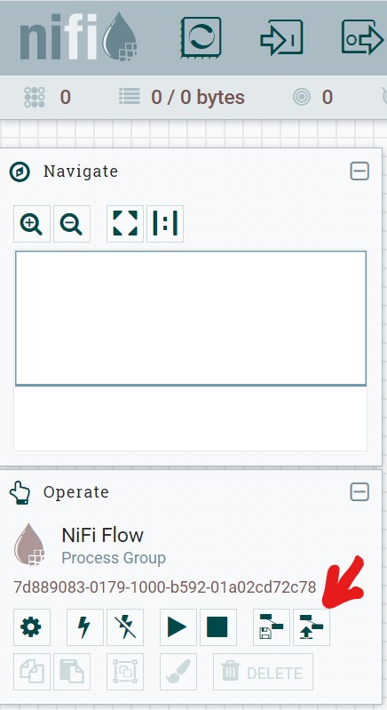

# NiFi Demo
A demo using Apache NiFi for authoring data pipelines connected
to multiple data sources running over multiple docker containers.

## NiFi Templates
* [CSV to JSON](./nifi/templates/convert-csv-to-json.xml): a simple template for
a data pipeline which pulls a CSV file from a folder, transform the CSV records to
a JSON format, then save it to a file 
* [import data from postgres to mongodb](./nifi/templates/database-to-mongo.xml): read
records from a database table  according to criteria, convert it into a JSON record,
then store it in a mongodb collection

## Requirements
To run this project, you need docker, docker-compose, and a web browser to run
jupyter notebooks and browse database contents

## How to run
Use docker-compose to run [docker-compose.yml](docker-compose.yml) file 
containing all required containers setup 

```shell script
docker-compose up
```
you can pass -d to run the containers in the background
```shell script
docker-compose up -d
```

## Docker containers and base images
Below table shows the docker containers that should run after executing
the docker-compose successfully

| container name  | base image                | Dockerfile                               | Description                                                                                                                                             |
|-----------------|---------------------------|------------------------------------------|---------------------------------------------------------------------------------------------------------------------------------------------------------|
| demo_jupyter    | jupyter /minimal-notebook | [Dockerfile](./jupyter/Dockerfile)       | A notebook to execute python scripts to generate sample CSV file and insert random records to database.  This is the entry point for the demo execution |
| mongodb         | mongo                     | [Dockerfile](./mongo/Dockerfile)         | A MongoDB server                                                                                                                                        |
| mongodb_express | mongo-express             | [Dockerfile](./mongo-express/Dockerfile) | A MongoDB express to browse MongoDB databases and collections                                                                                           |
| demo_nifi       | apache /nifi:latest       | [Dockerfile](./nifi/Dockerfile)          | An Apache NiFi container to run data pipelines                                                                                                          |
| demo_pgadmin    | dpage /pgadmin4           | [Dockerfile](./pgadmin/Dockerfile)       | A web browser for postgres database content                                                                                                             |
| demo_postgres   | postgres                  | [Dockerfile](./postgres/Dockerfile)      | Postgres Database engine, running with username and password "pg" and a database with name demoDB                                                       |

### URLs 
Once the docker containers are up, you can access the demo components by
following URLs below:

| URL                                                        | Credentials                              | Description                                                                                     |
|------------------------------------------------------------|------------------------------------------|-------------------------------------------------------------------------------------------------|
| [http://localhost:8888](http://localhost:8888)             | access token: demo123                    | Jupyter notebook to use when generating random sample CSV file and entries to Postgres database |
| [http://localhost:8080/nifi/](http://localhost:8080/nifi/) | Not required                             | NiFi UI to design, run, and monitor data pipelines                                              |
| [http://localhost:8000/](http://localhost:8000/)           | username: 1234@admin.com, password: 1234 | pgAdmin to browse Postgres database schemas                                                     |
| [http://localhost:8081/](http://localhost:8081/)           | Not required                             | A mongodb database browser                                                                      |

### Importing NiFi Templates
To run demo data pipelines, you need to import the template files through NiFi
interface, open [http://localhost:8080/nifi](http://localhost:8080/nifi) then click
on upload templates



upload template files one by one under from [nifi-templates](nifi/templates)

### Running data pipelines
To run the data pipeline which converts a CSV file to a JSON file, follow [csv-to-json.md](csv-to-json.md)

To run the data pipeline which reads records from Postgres database then inserts them to MongoDB, follow [db-to-mongo.md](db-to-mongo.md)
