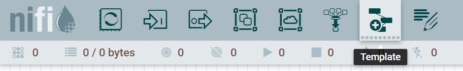
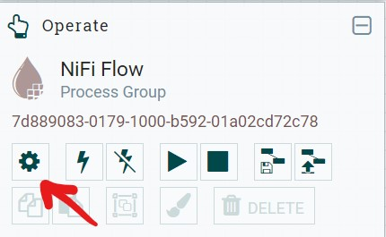
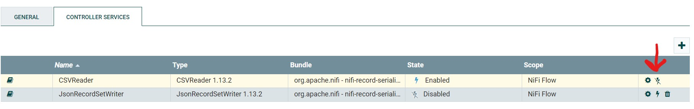
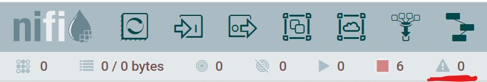
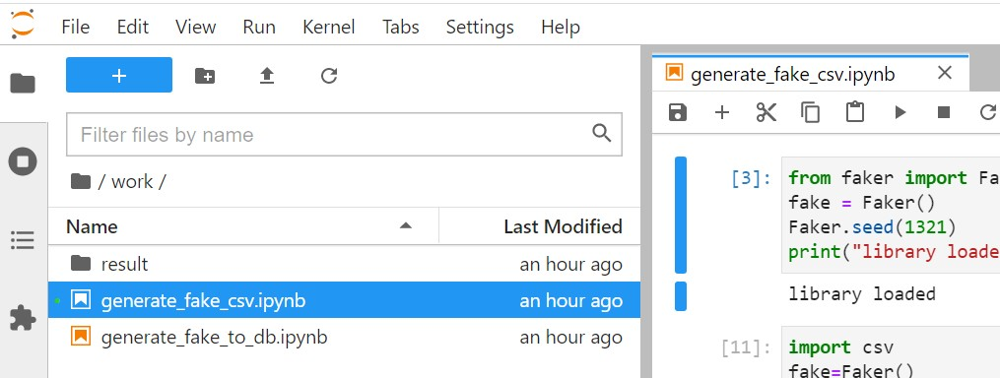
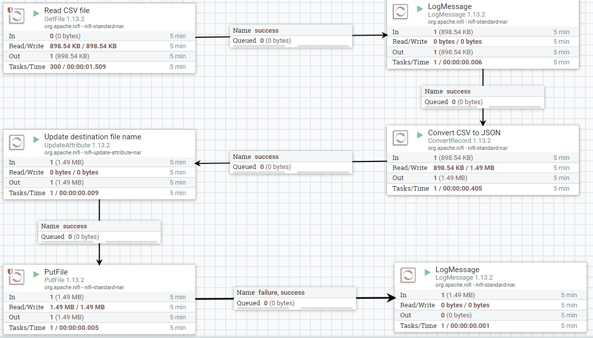
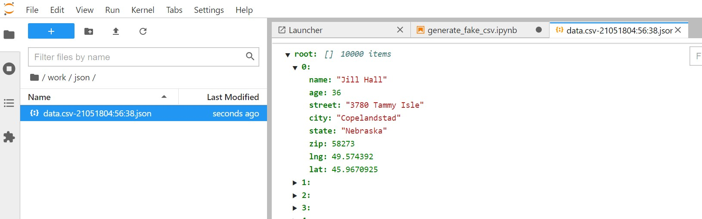

### Running CSV to JSON pipeline
* Through NiFi browser, drag the template icon from top bar to the design area  

  
* then select convert-csv-to-json 
  

* You need to activate the controllers configured in the pipeline by clicking on configuration icon 

  
* Navigate to controller services then enable all services 

  
* Make sure there are no warnings in pipeline 

  
* You can start the data pipeline now by clicking on start button
* This pipeline waits for a CSV file to be generated under specific path, to generate this file, navigate to jupyter notebook [http://localhost:8888](http://localhost:8888) then open python notebook [generate_fake_csv.ipynb](notebooks/generate_fake_csv.ipynb) under work folder 

  
* Execute the code inside the notebook
* Navigate back to NiFi browser, you should see how bytes are read and transferred between the pipeline processors 

  
* There is shared volumns between jupyter and NiFi containers, when you generate the CSV file
  from the jupyter it is going to be picked up directly from NiFi processors in case it is running
  you can see the results of the data pipeline through jupyter also under work/json

  
