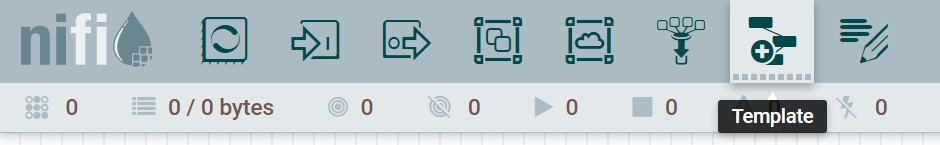
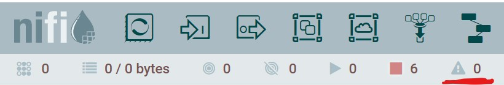
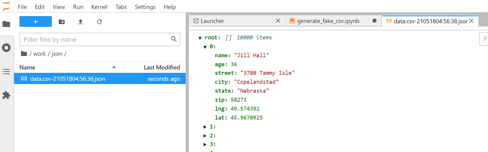

### Running DB to Mongo Data pipeline
* Through NiFi browser, drag the template icon from top bar to the design area  
  

* then select database-to-mongo 

  
* You need to activate the controllers configured in the pipeline by clicking on configuration icon 

  
* First we need to update the controllers configuration which connects to Postgres and MongoDB by settings the required passwords

  
  * To update MongoDB password, click on controller configuration icon, click on password property, then set the password to root

  
  * To update Postgres password, click on controller configuration icon, click on password property, then set the value to pg

  
* Navigate to controller services then enable all services 

  
* Make sure there are no warnings in pipeline 

  
* You can start the data pipeline now by clicking on start button
* This pipeline will keep query a Postgres table people under demoDB for any records with imported status equals to false.
  To generate fake records, navigate to jupyter notebook [http://localhost:8000](http://localhost:8000), 
  open notebook [generate_fake_to_db.ipynb](notebooks/generate_fake_to_db.ipynb), then execute the python script inside it

    
* Navigate back to NiFi browser, you should see how bytes are read and transferred between the pipeline processors 

  
* There is shared volumns between jupyter and NiFi containers, when you generate the CSV file
  from the jupyter it is going to be picked up directly from NiFi processors in case it is running
  you can see the results of the data pipeline through jupyter also under work/json

  
